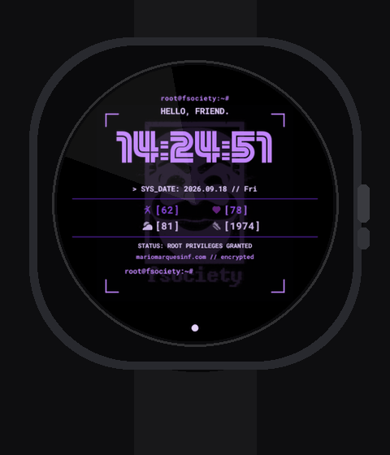
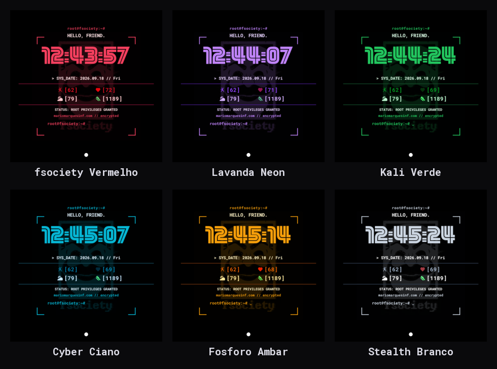

[🇬🇧 English](README.md) | [🇵🇹 Português](README.pt.md)

# Mr. Robot Terminal — Wear OS Watch Face

[](https://github.com/mariomarquesinf/mrrobot-watchface/actions/workflows/build.yml)
[](LICENSE)

A fully declarative, zero-code watch face for Wear OS, styled after the hacker/terminal
aesthetic of **Mr. Robot** (fsociety). Built entirely in Google's **Watch Face Format
(WFF)** — an XML scene graph interpreted natively by the OS, with no background service,
no APK code, and minimal battery impact.





## Why Watch Face Format

Most third-party Wear OS watch faces historically shipped as a running Android service
(a `WatchFaceService` with a render loop, executing app code on every tick). WFF inverts
that: the face is a **declarative XML document** — shapes, text, complications, and
color configuration — that the system's own renderer draws, the same way it draws its
own first-party faces. The trade-offs that shaped this project:

- **No executable code at all** (`android:hasCode="false"`) — the whole visual and
  data-binding logic lives in `app/src/main/res/raw/watchface.xml`.
- **System-managed lifecycle** — ambient mode, burn-in protection, and battery budgeting
  are handled by the OS renderer, not custom logic.
- **No unit-testing story.** There's no runtime to attach a debugger or test harness to —
  correctness can only be verified by installing the compiled scene graph on a real
  watch and observing it. Every layout and data-binding decision in this repo was
  validated empirically over ADB (live `logcat` + on-device screenshots), which is worth
  knowing before assuming "it renders" means "it's correct."

## Features

- **Terminal HUD aesthetic** — `root@fsociety:~#` prompt, `HELLO, FRIEND.` greeting, and
  a footer cursor that blinks in sync with the seconds tick (real terminal cursor
  behavior, driven by a `[SECOND] % 2` expression, not a fixed animation).
- **Hero digital clock** — large centered `hh:mm:ss` display, the visual focal point.
- **4 live, user-editable complications** (date, heart rate, battery, steps by default —
  freely reassignable to anything the OS offers) laid out as a straight, legible 2×2
  grid rather than curved bezel text.
- **fsociety mask watermark**, rendered as a monochrome alpha mask so it can be
  recolored live via the active theme's accent color, at low opacity so it stays a
  background element.
- **HUD corner reticle** instead of a plain bezel ring.
- **6 interchangeable color themes**, switchable on-device with zero code changes.

## Architecture notes

A few decisions worth calling out, since they weren't the first thing tried:

- **Complications show only the raw value in brackets** (`[62]`, `[1189]`), never a
  hardcoded category label like `BAT:` or `STP:`. Early versions baked in a label per
  slot; the problem is a user can reassign any slot to a *different* data source (e.g.
  swap "date" for a fitness app's "readiness" score) via the standard Wear OS
  customization UI, and a hardcoded label would silently go stale. Instead, each
  complication renders the assigned provider's own `MONOCHROMATIC_IMAGE` icon next to
  the value — the label is always sourced from whatever is actually selected, so it can
  never drift out of sync.
- **Centralized theming.** Every colored element — text, icons, the watermark tint, the
  divider lines — binds to `[CONFIGURATION.themeColor.N]`. Adding a 7th theme means
  adding one `<ColorOption>` block; no other file changes.
- **Curved bezel text was tried and reverted.** An earlier iteration wrapped
  complication values around the bezel using `TextCircular`. It looked correct in the
  XML and matched the documented geometry, but was empirically illegible on-device —
  characters rotate to stay tangent to the arc, which at small font sizes near the
  9/3 o'clock positions renders as unreadable noise. The fix wasn't a bug fix, it was a
  design change: switch to straight horizontal text.

## Color themes

| Theme | Text | Accent | Deep |
|---|---|---|---|
| fsociety Vermelho (default) | `#FFE4E6` | `#F43F5E` | `#881337` |
| Lavanda Neon | `#E9D5FF` | `#C084FC` | `#4C1D95` |
| Kali Verde Terminal | `#DCFCE7` | `#22C55E` | `#14532D` |
| Cyber Ciano | `#E0F2FE` | `#06B6D4` | `#164E63` |
| Fósforo Âmbar | `#FEF3C7` | `#F59E0B` | `#78350F` |
| Stealth Branco | `#FFFFFF` | `#CBD5E1` | `#334155` |

## Install

**Pre-built APK:** grab the latest from [Releases](../../releases) and sideload it:
```bash
adb install mrrobot_watchface.apk
```
Then long-press your current watch face and select **Mr. Robot Terminal**.

**Build from source:**
```bash
./gradlew assembleDebug
```
or, for a faster local iteration loop using `aapt2` directly (see `tools/build_apk.ps1`):
```powershell
./tools/build_apk.ps1
```
Requires Wear OS 4+ (API 33+) as the target device.

## Project structure

```
watchFace/
├── app/
│   └── src/main/
│       ├── AndroidManifest.xml       # WFF format version declaration, no code
│       └── res/
│           ├── raw/watchface.xml     # The entire scene graph: layout, complications, theming
│           ├── drawable/             # Launcher icon, store preview, watermark asset
│           ├── font/                 # Custom terminal/display typefaces
│           └── values/strings.xml    # Theme + complication slot display names
├── tools/                            # Local dev scripts (fast aapt2 build, ADB install, emulator preview)
├── docs/screenshots/                 # Theme gallery
└── build.gradle.kts / settings.gradle.kts
```

## License

MIT — see [LICENSE](LICENSE). "Mr. Robot" and "fsociety" belong to their respective
rights holders; this is an unofficial, non-commercial fan project.
